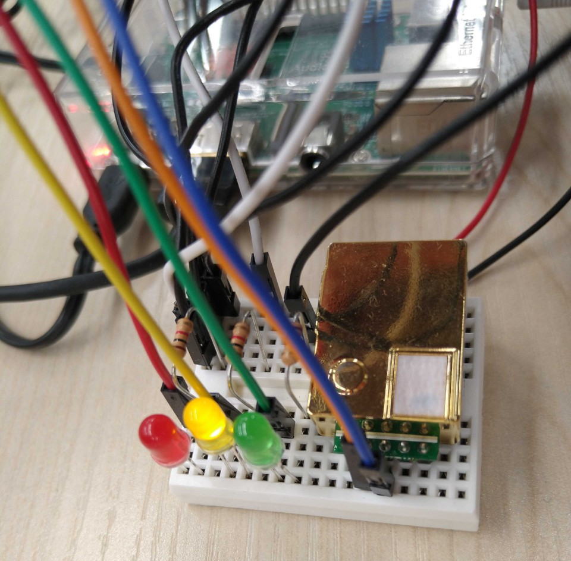

# co2signals

二酸化炭素センサー「MH-Z19B」とRaspberry PiとFirebaseを使った、二酸化炭素濃度の計測、記録、表示システムです。

## システム概要
- MH-Z19Bで収集したCO2の濃度により三色のLEDを点灯させます
- インターネットからグラフを確認できます（認証機能は未実装）

## 本体


## グラフ


# 必要なもの

## やる気と勢い
これ

## Raspberry Pi本体と周辺機器
Raspberry Pi 3Bを使用していますが、Zero WHなど他のモデルでも問題なさそうです。

電源、SDカード、キーボード、モニタ、インターネット回線などはもちろん必要です。

## MH-Z19B
メインとなる二酸化炭素センサー。0-5000ppmのものを使用しています。

Aliexpress、Amazonなどで購入できます。

ジャンパーワイヤを利用する場合はピンヘッダ付きがおすすめです。

データシート:
https://www.winsen-sensor.com/d/files/infrared-gas-sensor/mh-z19b-co2-ver1_0.pdf

## LED
信号機と同じく緑、黃、赤を使用します。

## 抵抗 330Ω - 1KΩ
LEDの種類にもよりますが、抵抗には330Ωが一般的なようです。1KΩは暗めになるので明るい場所では見ずらいかも。

## ブレッドボード、ジャンパーワイヤ （オプション）
はんだ付けせずに遊べるので便利です。

# MH-Z19BとRaspberry Piとの接続
使用しているこちらのパッケージと同じように配線してください。

https://github.com/UedaTakeyuki/mh-z19


キャリブレーションなども上記のパッケージで可能ですが説明は省きます。

## LEDと抵抗の接続


https://www.raspberrypi.org/documentation/usage/gpio/

下記のように接続します（LEDと抵抗の順番は逆でも可）。

- GPIO 2 → 緑LED+側 → 緑LED−側 → 抵抗 → Ground
- GPIO 3 → 黄LED+側 → 緑LED−側 → 抵抗 → Ground
- GPIO 4 → 赤LED+側 → 緑LED−側 → 抵抗 → Ground

それぞれの-側は6番などの任意のGroundに接続します。ブレッドボードであればまとめてつなげて問題ありません。

GPIO番号はモデルによって異なるかもしれないので確認してください。

# Raspberry Pi の設定
OSはRasbianで下記のバージョンで動作確認しています。

```
pi@raspberrypi3b:~ $ cat /etc/debian_version
9.11
```

## 必要なPythonパッケージのインストール
ソースコードをダウンロード
```
git clone https://github.com/uyamazak/co2signals.git
cd co2signals
```

```
sudo pip3 install gpiozero mh-z19 requests
```

## Pythonファイルの配置

```
# ディレクトリの作成
sudo mkdir /opt/co2signals/

# 実行ファイルをコピー
sudo cp -i src/run.py /opt/co2signals/run.py

# 設定ファイルをコピー、編集
sudo cp -i src/config.py.sample /opt/co2signals/config.py
sudo vim /opt/co2signals/config.py

# 設定ファイルを編集
sudo vim /opt/co2signals/config.py

```

## 実行

```
sudo /usr/bin/python3 /opt/co2signals/run.py
```

## systemdの設定
バックグラウンドで常時起動させる場合はsystemdを使用します。
```
# unitファイルをコピー
sudo cp -i service/co2signals.service /etc/systemd/system/co2signals.service

# 有効化
sudo systemctl enable co2signals

# 起動
sudo systemctl start co2signals

# 終了
sudo systemctl stop co2signals
```
## Firebase Functionsの環境変数を設定
Raspberry Piから送られたデータの保存には、簡易的にtoken認証を行っています。

`/opt/co2signals/config.py`に設定した値と同じにします。
```
firebase functions:config:set \
  raspi.token="yourtoken" \
  raspi.location="home"
```

## Slack & Cahtwork通知
設定すると1500ppmを超えるとFunctionsから現在のCo2濃度を含むメッセージを投稿します。

```
firebase functions:config:set \
  slack.webhook_url="https://hooks.slack.com/services/**********" \
  chatwork.api_token="your_token_here" \
  chatwork.room_id="room_number_here"
```

# デプロイ
## Firebase
GitHubのmasterレポジトリへのpushをトリガーとしてGoogle Cloud Build使ってやってます。

## Raspberry Pi
手と少しのシェルスクリプト
